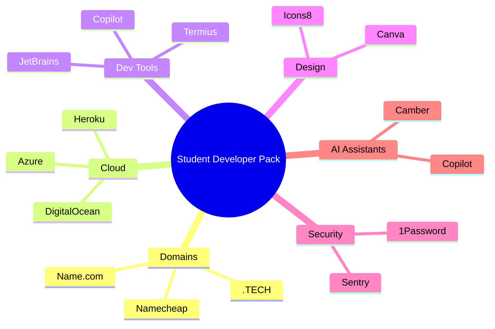
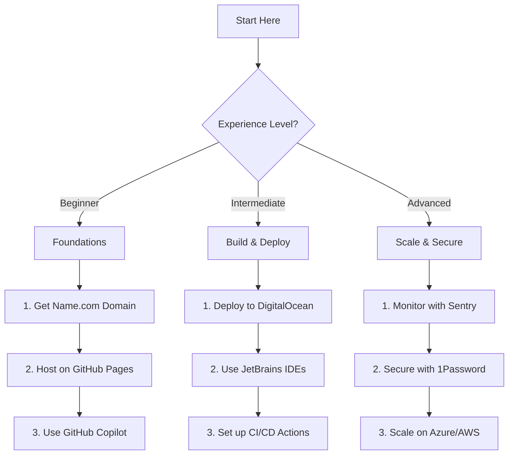
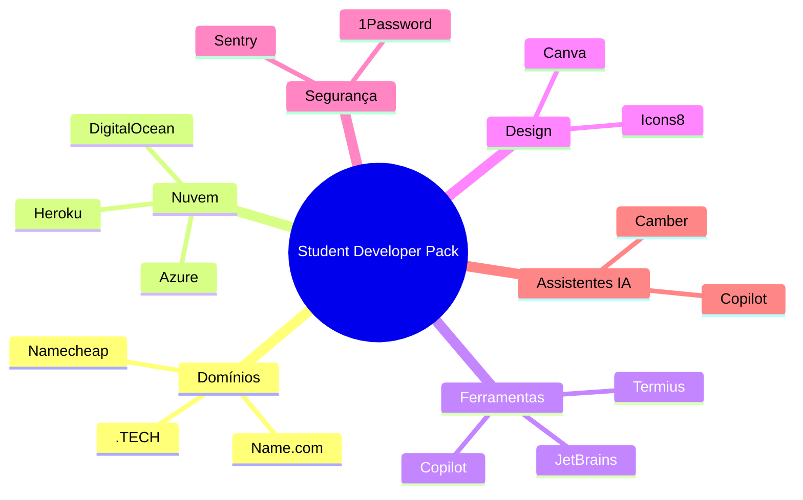
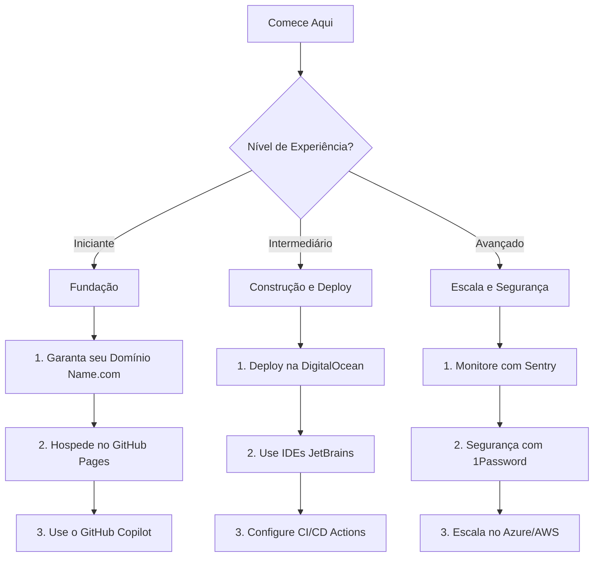

# 🚀 GitHub Student Developer Pack: Ultimate Guide & Starter Kit

[](https://education.github.com/pack)
[](https://opensource.org/licenses/MIT)
[](https://github.com/Genovese-Felipe)
[](http://makeapullrequest.com)

[🇺🇸 English](#english) | [🇧🇷 Português](#português)

```text
  ____  _             _            _     ____
 / ___|| |_ _   _  __| | ___ _ __ | |_  |  _ \  _____   __
 \___ \| __| | | |/ _` |/ _ \ '_ \| __| | | | |/ _ \ \ / /
  ___) | |_| |_| | (_| |  __/ | | | |_  | |_| |  __/\ V /
 |____/ \__|\__,_|\__,_|\___|_| |_|\__| |____/ \___| \_/

```

---

<a name="english"></a>
## 🇺🇸 English Version

### Welcome, Student Developer! 🎓
The **GitHub Student Developer Pack** is the greatest collection of free tools for students. This repository is designed to help you navigate these benefits and get started with your professional journey today.



### 🌟 Featured Offer: Name.com
Get a **free domain name** and **SSL certificate**! Perfect for hosting your portfolio or your next big project.

*   **Offer:** 1 free standard domain (extensions like .live, .studio, .software, .dev, etc.)
*   **Bonus:** Free SSL protection.
*   **How to get it:** Connect your GitHub account at [Name.com/partner/github-students](https://www.name.com/partner/github-students).
*   **Setup Guide:** See how to connect your domain to GitHub Pages [here](./resources/DOMAIN_SETUP.md).
*   **Hosting Guide:** Learn how to host your project for free [here](./resources/PAGES_GUIDE.md).
*   **Troubleshooting:** Fixed errors? Check the [Decision Tree here](./resources/TROUBLESHOOTING.md).

### 🛠️ Top 5 Pack Benefits
1.  **GitHub Copilot:** Your AI pair programmer (Autocomplete for your code).
2.  **JetBrains:** Professional IDEs (IntelliJ, PyCharm, etc.) for free.
3.  **DigitalOcean:** $200 in cloud credits to host your apps.
4.  **Canva:** 12 months of Canva Pro for your designs.
5.  **Microsoft Azure:** $100 in credit + free cloud services.

### 🗺️ Quick Start Guide

#### 🚀 Choose your Path



1.  **Apply:** Go to [education.github.com/pack](https://education.github.com/pack) and verify your student status.
2.  **Explore:** Browse the 100+ offers available.
3.  **Build:** Use the [included template](./index.html) in this repo to launch your first site on your new domain!

---

<a name="português"></a>
## 🇧🇷 Versão em Português

### Bem-vindo, Estudante Desenvolvedor! 🎓
O **GitHub Student Developer Pack** é a melhor coleção de ferramentas gratuitas para estudantes. Este repositório foi criado para ajudar você a aproveitar esses benefícios e começar sua jornada profissional hoje mesmo.



### 🌟 Oferta em Destaque: Name.com
Garanta um **domínio gratuito** e um **certificado SSL**! Perfeito para hospedar seu portfólio ou seu próximo grande projeto.

*   **Oferta:** 1 domínio padrão gratuito (extensões como .live, .studio, .software, .dev, etc.)
*   **Bônus:** Proteção SSL gratuita.
*   **Como conseguir:** Conecte sua conta do GitHub em [Name.com/partner/github-students](https://www.name.com/partner/github-students).
*   **Guia de Configuração:** Veja como conectar seu domínio ao GitHub Pages [aqui](./resources/CONFIGURACAO_DOMINIO.md).
*   **Guia de Hospedagem:** Aprenda a hospedar seu projeto gratuitamente [aqui](./resources/GUIA_PAGES.md).
*   **Solução de Problemas:** Erros? Veja a [Árvore de Decisão aqui](./resources/GUIA_SUPORTE.md).

### 🛠️ Top 5 Benefícios do Pack
1.  **GitHub Copilot:** Seu par de programação IA (Autocompleta seu código).
2.  **JetBrains:** IDEs profissionais (IntelliJ, PyCharm, etc.) de graça.
3.  **DigitalOcean:** $200 em créditos na nuvem para hospedar seus apps.
4.  **Canva:** 12 meses de Canva Pro para seus designs.
5.  **Microsoft Azure:** $100 em créditos + serviços de nuvem gratuitos.

### 🗺️ Guia de Início Rápido

#### 🚀 Escolha seu Caminho



1.  **Inscreva-se:** Vá para [education.github.com/pack](https://education.github.com/pack) e verifique seu status de estudante.
2.  **Explore:** Navegue pelas mais de 100 ofertas disponíveis.
3.  **Construa:** Use o [template incluído](./index.html) neste repo para lançar seu primeiro site no seu novo domínio!

---

### 📺 Video Guide / Guia em Vídeo
Check out how to get started / Veja como começar:

[](https://www.youtube.com/watch?v=i21-AjPpiFc)

---
*Created with ❤️ for students worldwide.*
