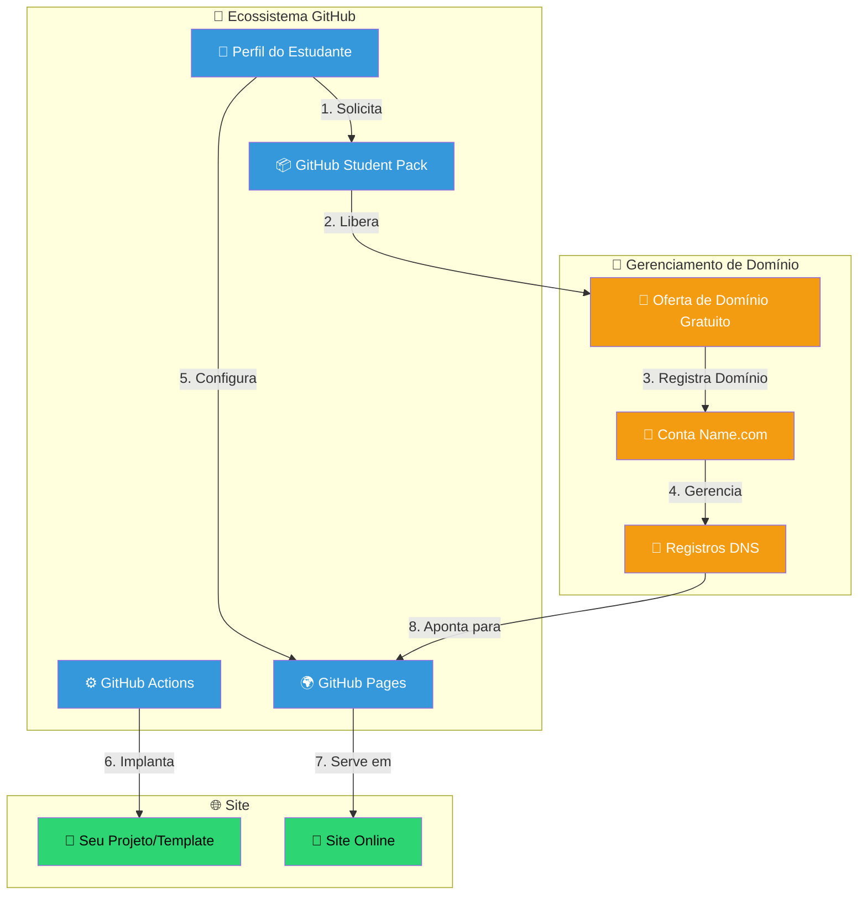
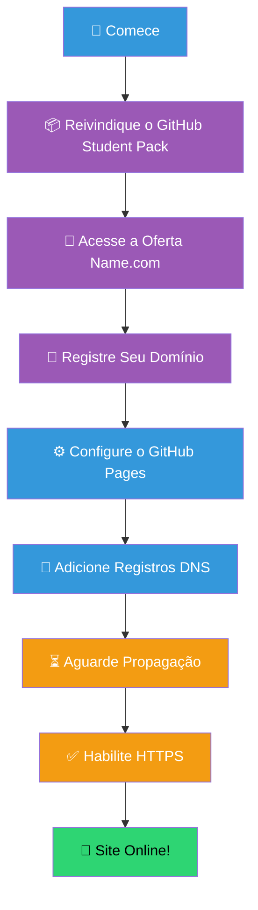
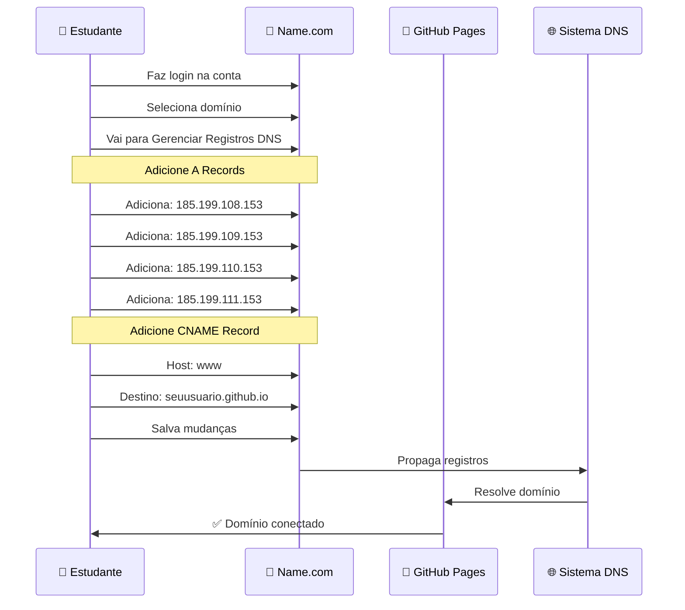
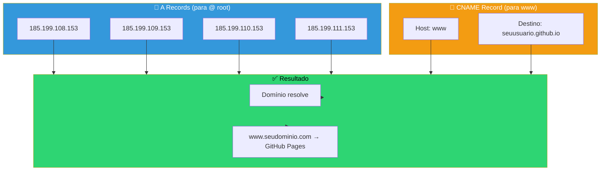
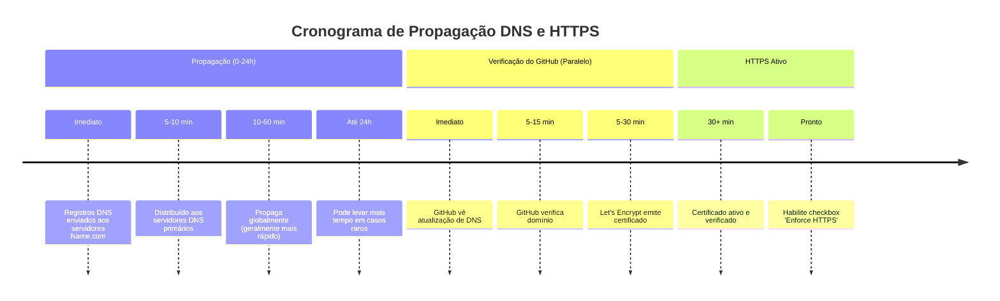
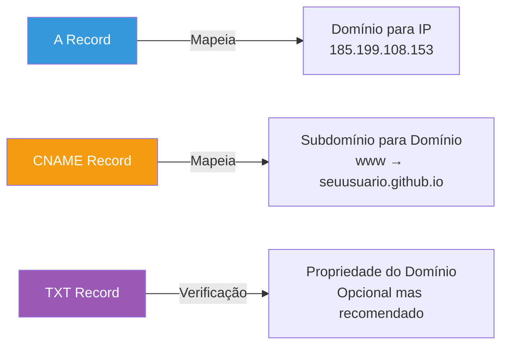

# 🌐 Conectando seu Domínio Name.com ao GitHub Pages

Depois de garantir seu domínio gratuito pelo GitHub Student Developer Pack, siga estes passos para hospedar seu site (como o template neste repo) no seu novo domínio.

## 📊 Arquitetura Completa de Implantação

## 🔄 Fluxo de Implantação Passo a Passo

## Passo 1: Configurar o GitHub Pages

### Passos:
1. Vá nas **Settings** (Configurações) do seu repositório.
2. Clique em **Pages** na barra lateral esquerda.
3. Em **Custom domain**, digite seu novo domínio (ex: `www.seunome.software`).
4. Clique em **Save**. Isso criará um arquivo `CNAME` no seu repositório.

## Passo 2: Configurar o DNS no Name.com

### Detalhes de Configuração DNS

### Processo de Configuração:

1. Faça login na sua conta do [Name.com](https://www.name.com).
2. Vá em **My Domains** e clique no seu domínio.
3. Clique em **Manage DNS Records**.
4. **Adicione A Records** apontando para os IPs do GitHub:
   - `185.199.108.153`
   - `185.199.109.153`
   - `185.199.110.153`
   - `185.199.111.153`
5. **Adicione CNAME Record**:
   - Host: `www`
   - Resposta: `seuusuario.github.io`
6. Clique **Save** (Salvar)

## Passo 3: Aguarde e Verifique

### Passos de Verificação:

**Verifique a Configuração do Seu Domínio**

- [ ] Aguarde 5-10 minutos para propagação inicial
- [ ] Volte para GitHub Settings > Pages
- [ ] Verifique se arquivo CNAME foi criado
- [ ] Marque checkbox 'Enforce HTTPS' (quando disponível)
- [ ] Teste seu domínio no navegador
- [ ] Verifique se certificado é válido
- [ ] Teste tanto `www.dominio.com` quanto `dominio.com`

---

## 💡 Dicas de Especialista & Resolução de Problemas

### Referência Rápida - Endereços IP do GitHub

| Provedor | Endereço IP |
|----------|-----------|
| GitHub Pages | 185.199.108.153 |
| GitHub Pages | 185.199.109.153 |
| GitHub Pages | 185.199.110.153 |
| GitHub Pages | 185.199.111.153 |

### Tipos Comuns de Registros DNS

> [!TIP]
> **SSL/TLS:** Pode levar alguns minutos para a opção "Enforce HTTPS" ficar disponível após configurar o DNS. Tenha paciência!

> [!NOTE]
> **Propagação:** Use ferramentas como [Google DNS Lookup](https://developers.google.com/speed/public-dns/docs/troubleshooting) ou [What's My DNS](https://www.whatsmydns.net/) para acompanhar as mudanças de DNS mundialmente.

> [!WARNING]
> **Conflitos de CNAME:** Não tenha tanto um A record quanto um CNAME record para o mesmo subdomínio. Escolha um por hostname.

---

## 🔗 Recursos de Referência

- [Documentação do GitHub Pages](https://docs.github.com/pt/pages/configuring-a-custom-domain-for-your-github-pages-site)
- [Suporte Name.com](https://www.name.com)
- [Endereços IP do GitHub Pages](https://docs.github.com/pt/pages/configuring-a-custom-domain-for-your-github-pages-site/managing-a-custom-domain-for-your-github-pages-site)
- [Verificador de Propagação DNS](https://www.whatsmydns.net/)
