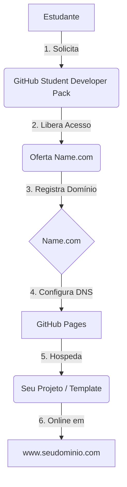
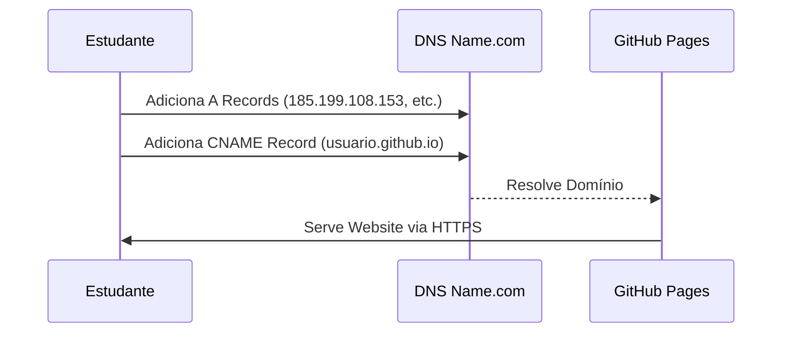

# 🌐 Conectando seu Domínio Name.com ao GitHub Pages

Depois de garantir seu domínio gratuito pelo GitHub Student Developer Pack, siga estes passos para hospedar seu site (como o template neste repo) no seu novo domínio.

## 📊 Fluxo de Implantação

## Passo 1: Configurar o GitHub Pages
1. Vá nas **Settings** (Configurações) do seu repositório.
2. Clique em **Pages** na barra lateral esquerda.
3. Em **Custom domain**, digite seu novo domínio (ex: `www.seunome.software`).
4. Clique em **Save**. Isso criará um arquivo `CNAME` no seu repositório.

## Passo 2: Configurar o DNS no Name.com

1. Faça login na sua conta do [Name.com](https://www.name.com).
2. Vá em **My Domains** e clique no seu domínio.
3. Clique em **Manage DNS Records**.
4. Adicione os seguintes **A Records** apontando para os IPs do GitHub:
   - `185.199.108.153`
   - `185.199.109.153`
   - `185.199.110.153`
   - `185.199.111.153`
5. Adicione um **CNAME Record**:
   - Host: `www`
   - Resposta: `seuusuario.github.io`

## Passo 3: Aguarde e Verifique
- Alterações de DNS podem levar até 24 horas para propagar (geralmente é mais rápido).
- Quando estiver pronto, volte para GitHub Settings > Pages e marque **Enforce HTTPS**.

---

## 💡 Dicas de Especialista

> [!TIP]
> **SSL/TLS:** Pode levar alguns minutos para a opção "Enforce HTTPS" ficar disponível após configurar o DNS. Tenha paciência!

> [!NOTE]
> **Propagação:** Use ferramentas como o [Google DNS Lookup](https://developers.google.com/speed/public-dns/docs/troubleshooting) para acompanhar as mudanças de DNS.

---
*Referência: [Documentação do GitHub Pages](https://docs.github.com/pt/pages/configuring-a-custom-domain-for-your-github-pages-site)*
