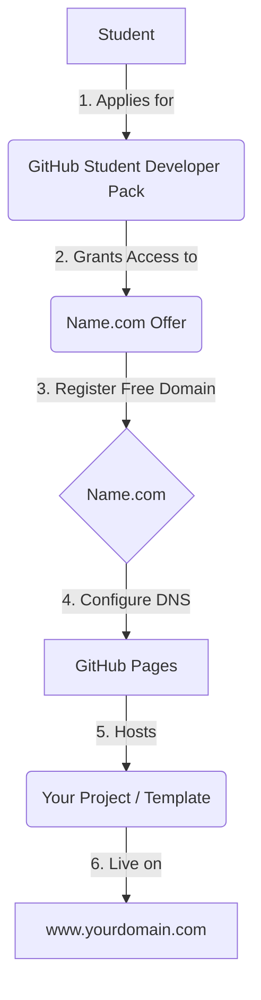
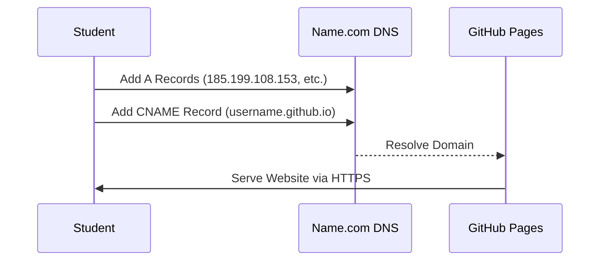

# 🌐 Connecting your Name.com Domain to GitHub Pages

After getting your free domain from the GitHub Student Developer Pack, follow these steps to host your site (like the template in this repo) on your new domain.

## 📊 Deployment Flow

## Step 1: Configure GitHub Pages
1. Go to your repository **Settings**.
2. Click on **Pages** in the left sidebar.
3. Under **Custom domain**, type your new domain (e.g., `www.yourname.software`).
4. Click **Save**. This creates a `CNAME` file in your repository.

## Step 2: Configure Name.com DNS

1. Log in to your [Name.com](https://www.name.com) account.
2. Go to **My Domains** and click on your domain.
3. Click on **Manage DNS Records**.
4. Add the following **A Records** pointing to GitHub's IP addresses:
   - `185.199.108.153`
   - `185.199.109.153`
   - `185.199.110.153`
   - `185.199.111.153`
5. Add a **CNAME Record**:
   - Host: `www`
   - Answer: `yourusername.github.io`

## Step 3: Wait and Verify
- DNS changes can take up to 24 hours to propagate (usually faster).
- Once ready, go back to GitHub Settings > Pages and check **Enforce HTTPS**.

---

## 💡 Pro Tips

> [!TIP]
> **SSL/TLS:** It can take a few minutes for the "Enforce HTTPS" checkbox to become available after setting up your DNS. Be patient!

> [!NOTE]
> **Propagation:** Use tools like [Google DNS Lookup](https://developers.google.com/speed/public-dns/docs/troubleshooting) to track your DNS changes.

---
*Reference: [GitHub Pages Documentation](https://docs.github.com/en/pages/configuring-a-custom-domain-for-your-github-pages-site)*
