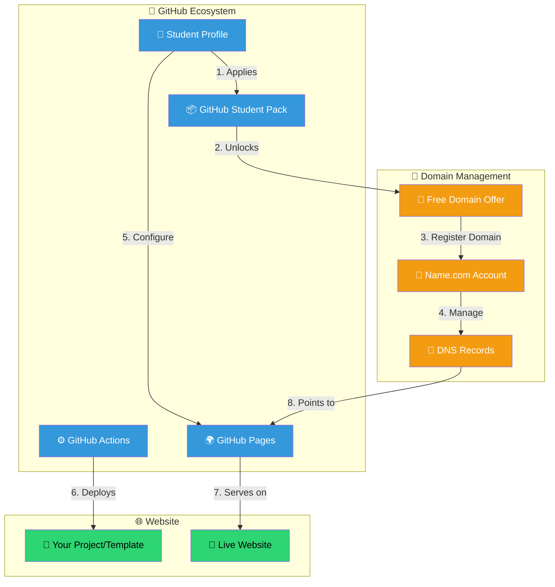
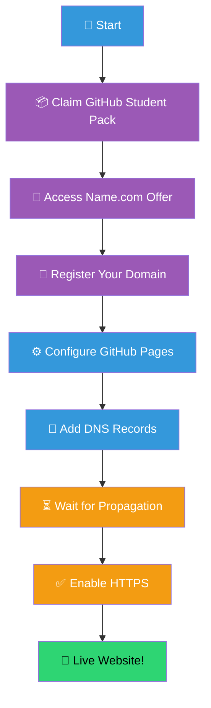
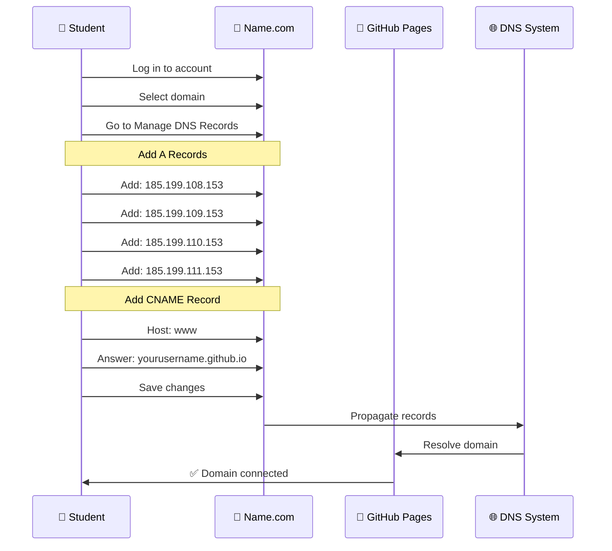
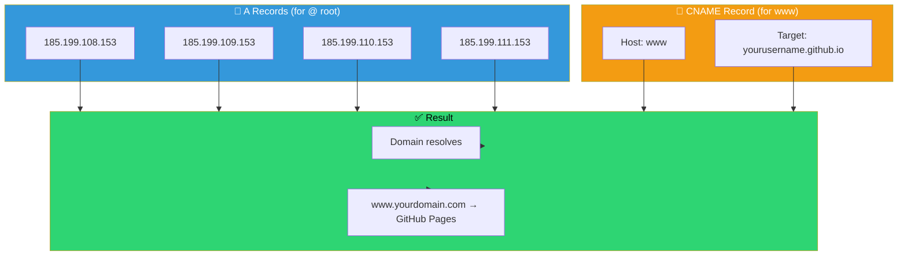
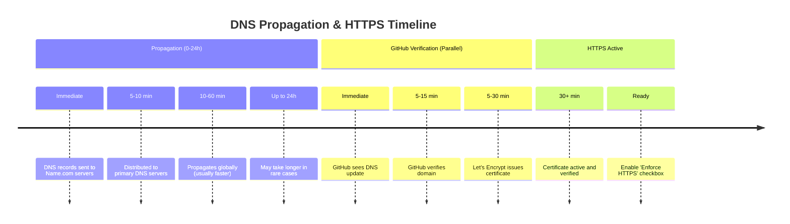
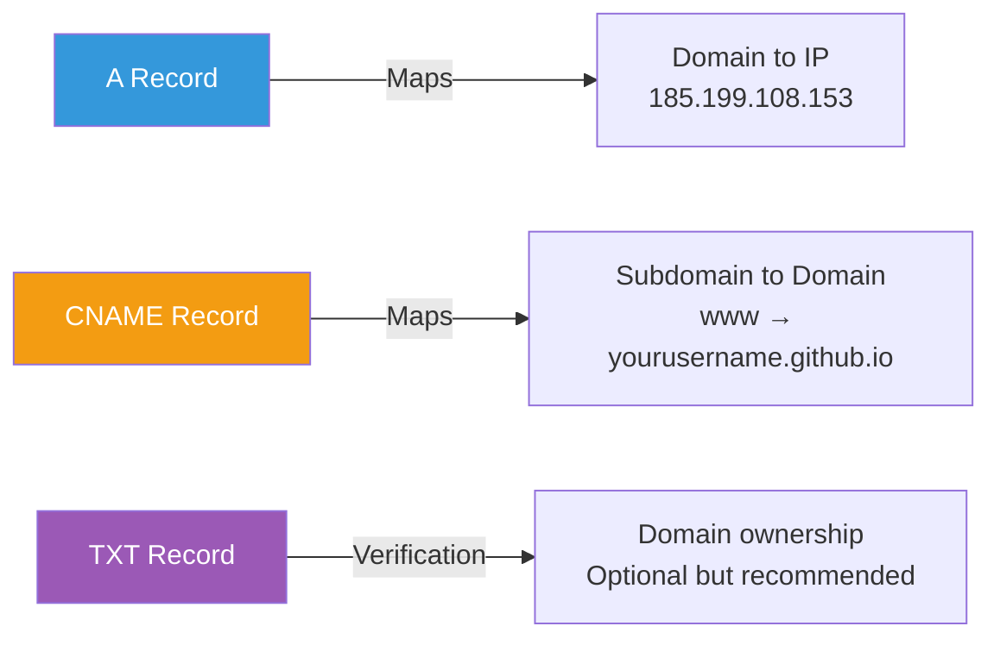

# 🌐 Connecting your Name.com Domain to GitHub Pages

After getting your free domain from the GitHub Student Developer Pack, follow these steps to host your site (like the template in this repo) on your new domain.

## 📊 Complete Deployment Architecture



## 🔄 Step-by-Step Deployment Flow



## Step 1: Configure GitHub Pages


### Steps:
1. Go to your repository **Settings**.
2. Click on **Pages** in the left sidebar.
3. Under **Custom domain**, type your new domain (e.g., `www.yourname.software`).
4. Click **Save**. This creates a `CNAME` file in your repository.

## Step 2: Configure Name.com DNS



### DNS Configuration Details



### Configuration Process:

1. Log in to your [Name.com](https://www.name.com) account.
2. Go to **My Domains** and click on your domain.
3. Click on **Manage DNS Records**.
4. **Add A Records** pointing to GitHub's IP addresses:
   - `185.199.108.153`
   - `185.199.109.153`
   - `185.199.110.153`
   - `185.199.111.153`
5. **Add CNAME Record**:
   - Host: `www`
   - Answer: `yourusername.github.io`
6. Click **Save**

## Step 3: Wait and Verify



### Verification Steps:

```mermaid
checklist
    title Verify Your Domain Setup
    - Wait 5-10 minutes for initial propagation
    - Go back to GitHub Settings > Pages
    - Verify CNAME file was created
    - Check 'Enforce HTTPS' checkbox (when available)
    - Test your domain in browser
    - Verify certificate is valid
    - Check both www.domain.com and domain.com
```

---

## 💡 Pro Tips & Troubleshooting

### Quick Reference - GitHub IP Addresses

| Provider | IP Address |
|----------|-----------|
| GitHub Pages | 185.199.108.153 |
| GitHub Pages | 185.199.109.153 |
| GitHub Pages | 185.199.110.153 |
| GitHub Pages | 185.199.111.153 |

### Common DNS Record Types



> [!TIP]
> **SSL/TLS:** It can take a few minutes for the "Enforce HTTPS" checkbox to become available after setting up your DNS. Be patient!

> [!NOTE]
> **Propagation:** Use tools like [Google DNS Lookup](https://developers.google.com/speed/public-dns/docs/troubleshooting) or [What's My DNS](https://www.whatsmydns.net/) to track your DNS changes worldwide.

> [!WARNING]
> **CNAME Conflicts:** Don't have both an A record AND a CNAME record for the same subdomain. Pick one per hostname.

---

## 🔗 Reference Resources

- [GitHub Pages Documentation](https://docs.github.com/en/pages/configuring-a-custom-domain-for-your-github-pages-site)
- [Name.com DNS Management](https://www.name.com/support/articles/115004149548)
- [GitHub Pages IP Addresses](https://docs.github.com/en/pages/configuring-a-custom-domain-for-your-github-pages-site/managing-a-custom-domain-for-your-github-pages-site)
- [DNS Propagation Checker](https://www.whatsmydns.net/)
