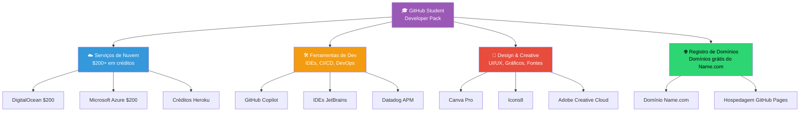
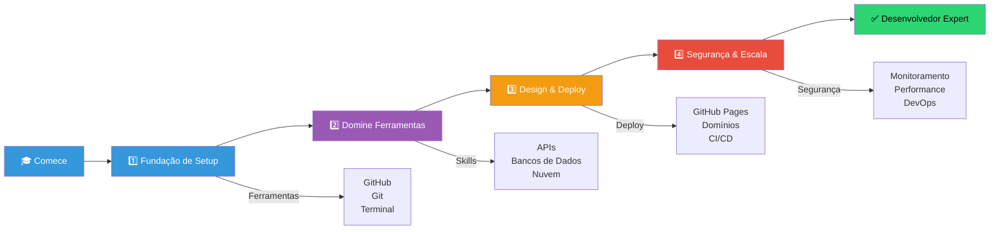
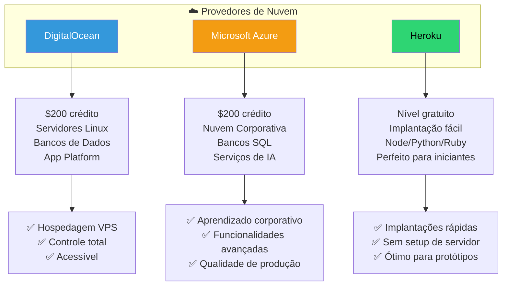
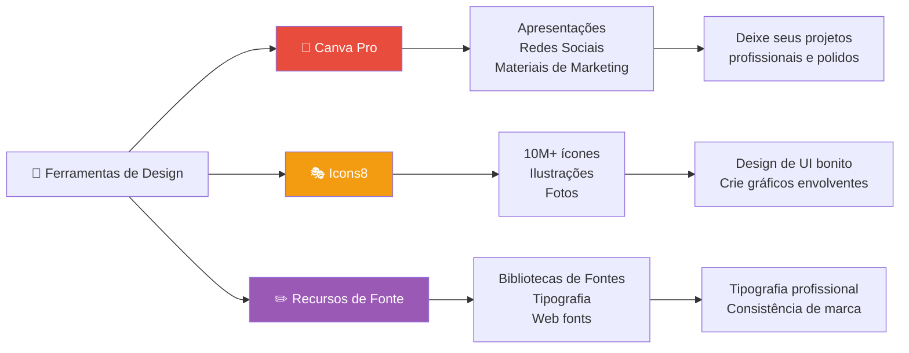
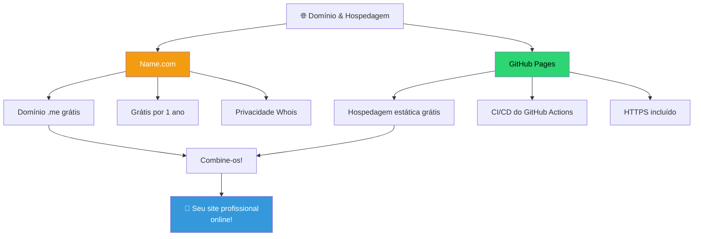
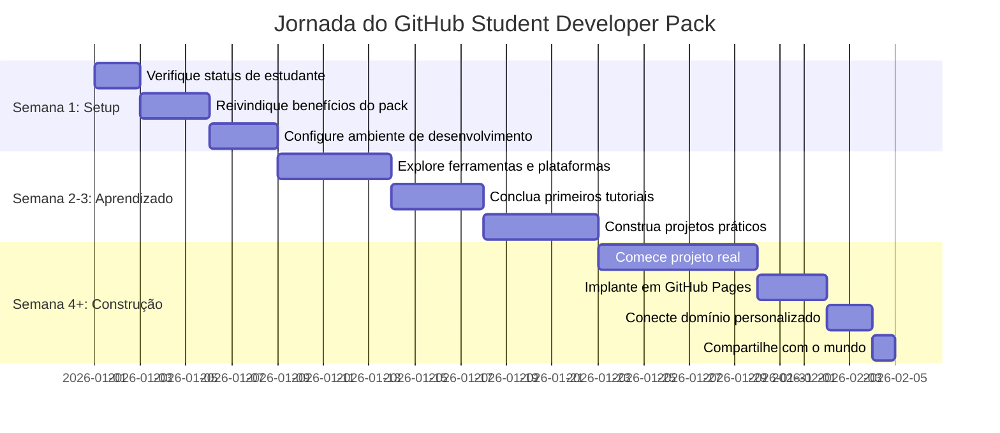
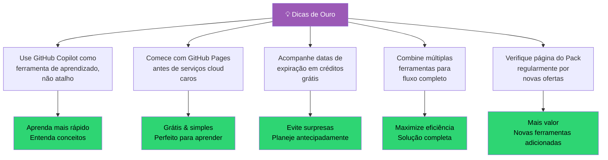

# 📚 Guia do GitHub Student Developer Pack

Bem-vindo ao seu guia completo para maximizar o GitHub Student Developer Pack! Este pacote inclui mais de $200+ em créditos e serviços grátis para ajudá-lo a aprender e construir projetos incríveis.

## 🎯 O que é GitHub Student Developer Pack?

## 📊 Trilha de Aprendizado e Crescimento

## ☁️ Serviços de Nuvem & Hospedagem

## 💻 Ferramentas de Desenvolvimento & IDEs

```mermaid
graph TD
    Tools["🛠️ Ferramentas de Desenvolvimento"]
    
    Tools --> Copilot["🤖 GitHub Copilot"]
    Tools --> IDEs["📝 IDEs JetBrains"]
    Tools --> Terminal["⌨️ Termius SSH"]
    Tools --> Monitoring["📊 Datadog"]
    
    Copilot --> C1["Assistente de Código com IA"]
    Copilot --> C2["Explicações de código"]
    Copilot --> C3["24/7 para estudantes"]
    
    IDEs --> I1["IntelliJ (Java)"]
    IDEs --> I2["PyCharm (Python)"]
    IDEs --> I3["WebStorm (JS/TS)"]
    IDEs --> I4["Padrão da indústria"]
    
    Terminal --> T1["Gerenciamento SSH"]
    Terminal --> T2["Suporte mobile"]
    Terminal --> T3["Multiplataforma"]
    
    Monitoring --> M1["Monitoramento de aplicações"]
    Monitoring --> M2["Rastreamento de performance"]
    Monitoring --> M3["Rastreamento de erros"]
    
    style Copilot fill:#3498db,color:#fff
    style IDEs fill:#9b59b6,color:#fff
    style Terminal fill:#f39c12,color:#fff
    style Monitoring fill:#e74c3c,color:#fff
```

## 🎨 Design e Criatividade

## 🌐 Domínios & Hospedagem Web

## 📦 Recursos Selecionados por Categoria

### ☁️ Nuvem e Hospedagem
- **DigitalOcean:** Perfeito para servidores Linux simples (Droplets). Use seus $200 de crédito com sabedoria!
- **Microsoft Azure:** Ótimo para aprender nuvem de nível empresarial. Inclui nível gratuito para bancos de dados SQL.
- **Heroku:** Implementação fácil para aplicativos Node.js, Python e Ruby.

### 💻 Ferramentas de Desenvolvimento
- **GitHub Copilot:** Não deixe apenas que ele escreva o código; use-o para *explicar* o código que você não entende.
- **IDEs da JetBrains:** IntelliJ IDEA (Java), PyCharm (Python), WebStorm (JS/TS). Estas são o padrão da indústria.
- **Termius:** A melhor maneira de gerenciar suas conexões SSH no desktop e no celular.

### 🎨 Design e Produtividade
- **Canva Pro:** Essencial para criar apresentações, posts para redes sociais e até seu currículo.
- **Icons8:** Milhares de ícones e ilustrações para deixar seus aplicativos profissionais.
- **1Password:** Mantenha seus segredos de desenvolvimento e senhas pessoais seguros gratuitamente por um ano.

## ✅ Lista de Verificação para Começar

**Comece a Usar Seu Pack Hoje**

- [ ] Verifique seu status de estudante no GitHub
- [ ] Visite education.github.com/pack
- [ ] Reivindique seu domínio grátis do Name.com
- [ ] Configure o GitHub Copilot
- [ ] Instale seu IDE JetBrains preferido
- [ ] Crie seu primeiro site do GitHub Pages
- [ ] Explore DigitalOcean ou Azure
- [ ] Construa algo incrível!

## 🚀 Cronograma: Do Pack à Produção

## 💡 Dicas de Ouro para Máximo Valor

---

## 🔗 Recursos Importantes

- **Página Oficial do Pack:** [education.github.com/pack](https://education.github.com/pack)
- **Verifique Seu Status:** Confira seu distintivo de estudante GitHub nas configurações da conta
- **Contato de Suporte:** Cada serviço tem suporte dedicado para estudantes

---

### 💡 Pensamento Final
Verifique a [página do Pack](https://education.github.com/pack) regularmente, pois novas ofertas são adicionadas com frequência! Aproveite ao máximo esses recursos durante seus anos de estudante — são incrivelmente valiosos para sua jornada de desenvolvimento.
