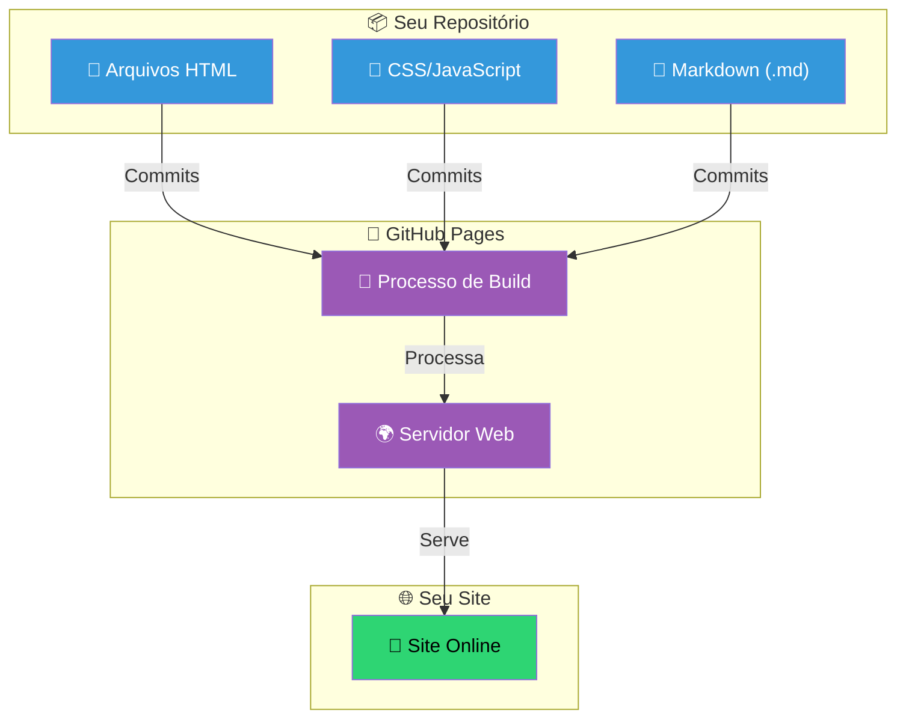
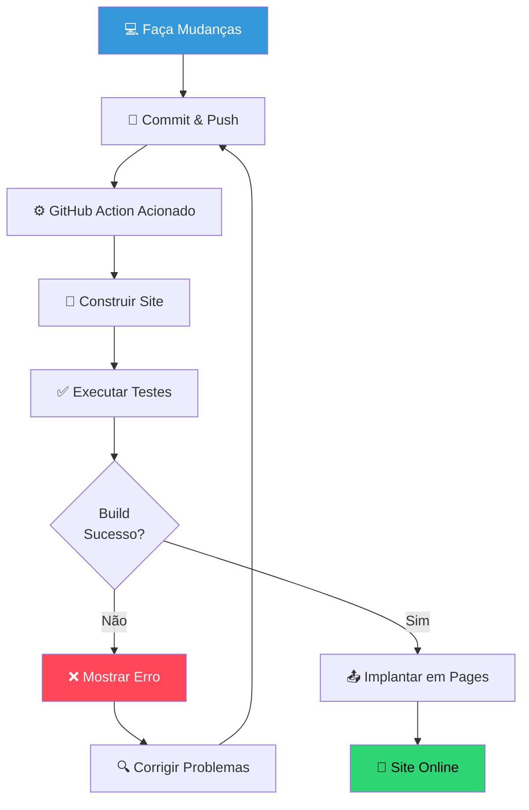
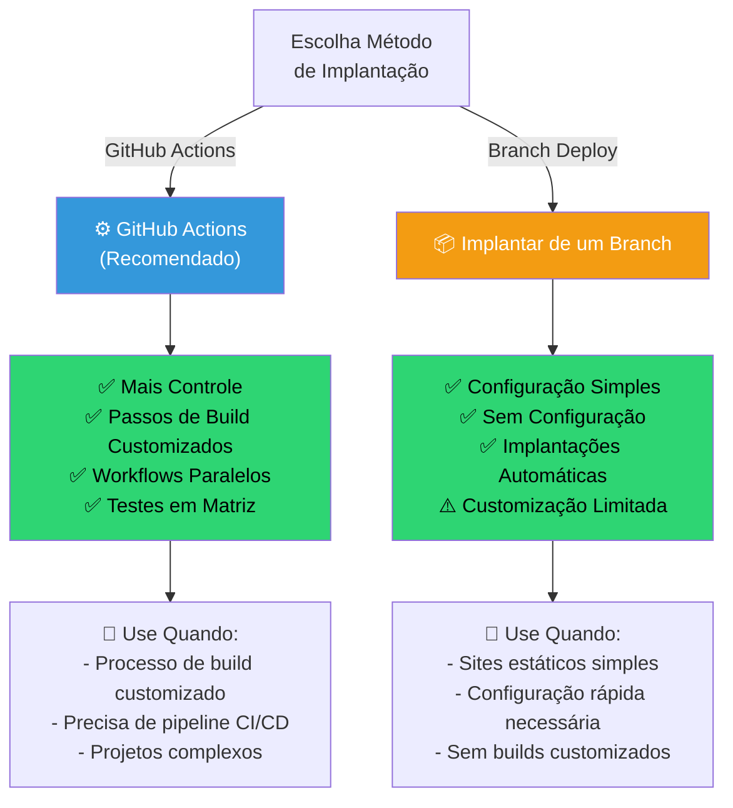
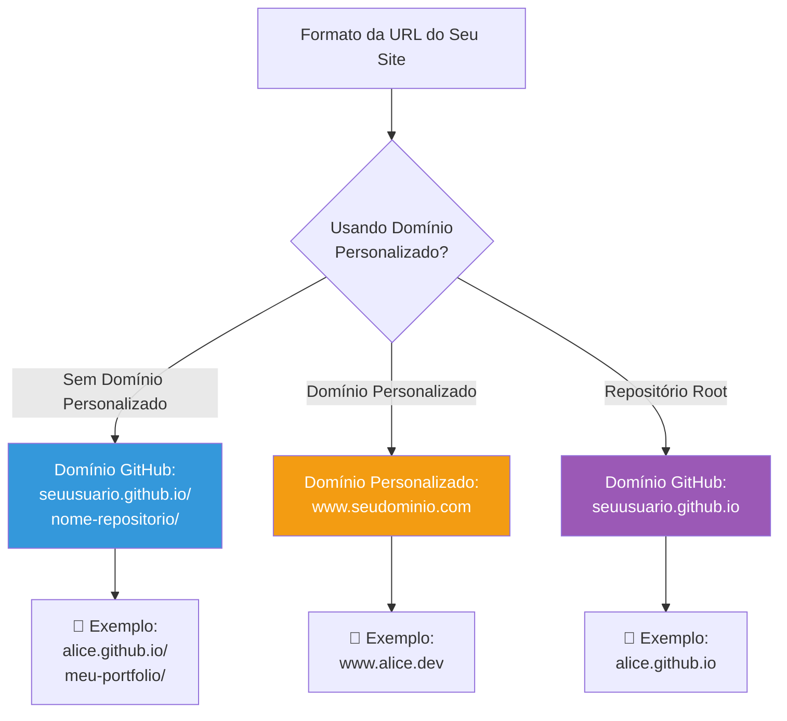
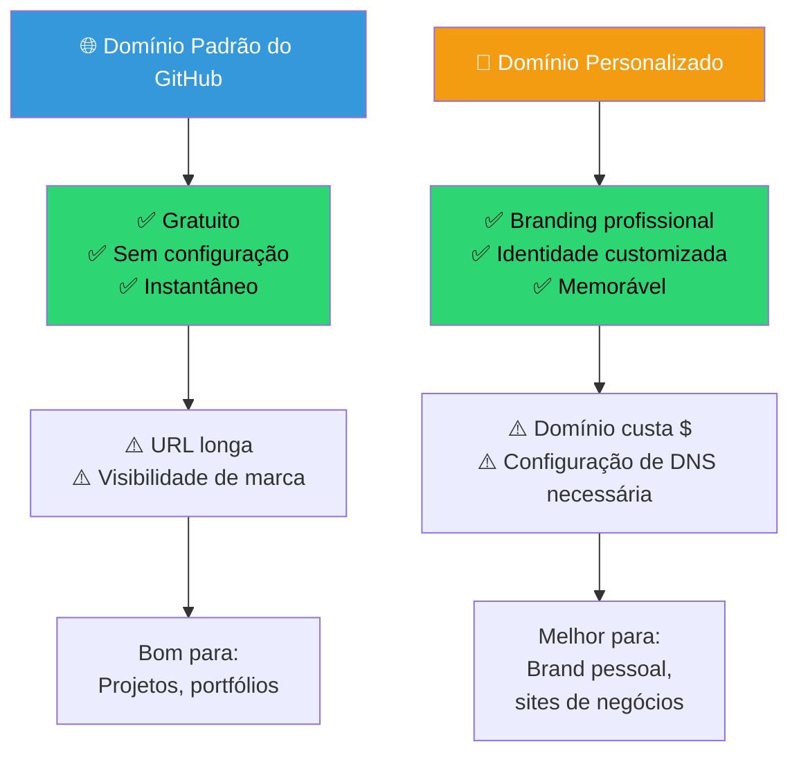
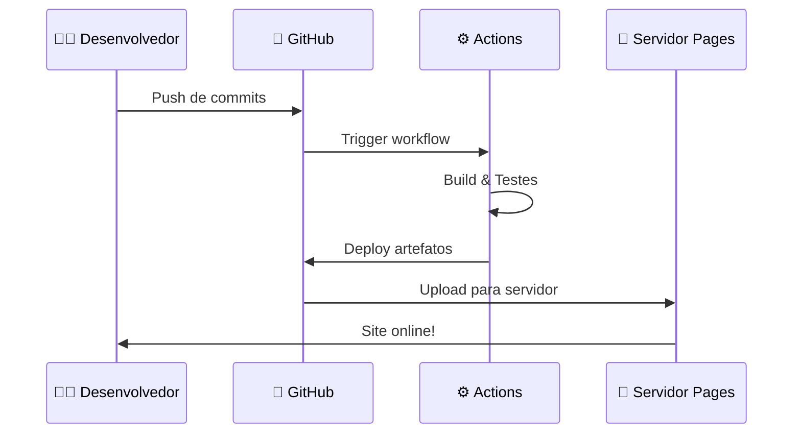

# 📚 Usando o GitHub Pages para Hospedagem Simples

## 🎯 O que é GitHub Pages?

GitHub Pages é um serviço de hospedagem de sites estáticos gratuito que pega arquivos HTML, CSS e JavaScript diretamente de um repositório no GitHub e publica seu site.

## 🏗️ Visão Geral da Arquitetura

## 🔄 Processo de Implantação

## 🎯 Como Ativar o GitHub Pages

### Configuração em 5 Passos:

**Ativar GitHub Pages em 5 Passos**

- [ ] Navegue até Settings do repositório
- [ ] Clique em 'Pages' na barra lateral
- [ ] Selecione 'GitHub Actions' (recomendado) ou 'Deploy from a branch'
- [ ] Se 'Deploy from a branch': Escolha seu branch principal
- [ ] Clique Save e aguarde 1-2 minutos

## 🚀 Comparação de Opções de Implantação

## 🌐 Formatos de URL

## 📊 Guia de Configuração Eficiente

Sempre que alguém clica no nome do seu repositório, pode acessar um site convencional do GitHub Pages. Isso permite que você apresente tudo o que está criando de forma amigável, tornando seu trabalho acessível para que qualquer pessoa possa revisar e se familiarizar com ele.

## 🎨 Opção de Domínio Personalizado

Cabe a cada usuário decidir se deseja aplicar seu domínio personalizado (como o do Name.com) ao seu novo site. Essa flexibilidade permite o branding pessoal e melhora a aparência profissional e a acessibilidade do site.

## 🔄 Fluxo Típico do GitHub Pages

## ✅ Lista de Verificação

**Verifique Configuração do GitHub Pages**

- [ ] Repositório é público
- [ ] GitHub Pages está habilitado em Settings
- [ ] Branch de origem está correto
- [ ] Build foi bem-sucedido
- [ ] URL do site corresponde ao esperado
- [ ] Consegue acessar site pelo navegador
- [ ] Conteúdo está exibindo corretamente
- [ ] Links estão funcionando

## 🚀 Próximos Passos

- **Adicione Conteúdo**: Comece a construir seu site com HTML/CSS/Markdown
- **Domínio Personalizado**: Siga o guia de Configuração de Domínio para conectar seu domínio Name.com
- **Customize**: Adicione seus próprios temas, estilos e conteúdo
- **Compartilhe**: Compartilhe o link do seu site com o mundo!

## 📚 Conclusão

Em resumo, o GitHub Pages oferece uma maneira simples e eficaz de exibir seus projetos, ao mesmo tempo em que oferece a opção de domínios personalizados para quem deseja mais personalização. Quer você escolha usar o domínio padrão do GitHub ou um personalizado, você terá uma solução de hospedagem profissional e gratuita para seus projetos web.

---

## 🔗 Saiba Mais

- [Documentação Oficial do GitHub Pages](https://docs.github.com/pt/pages)
- [Jekyll (Gerador de Sites Estáticos Integrado)](https://jekyllrb.com/)
- [GitHub Student Developer Pack](https://education.github.com/pack)
- [Registro de Domínio Name.com](https://www.name.com)
