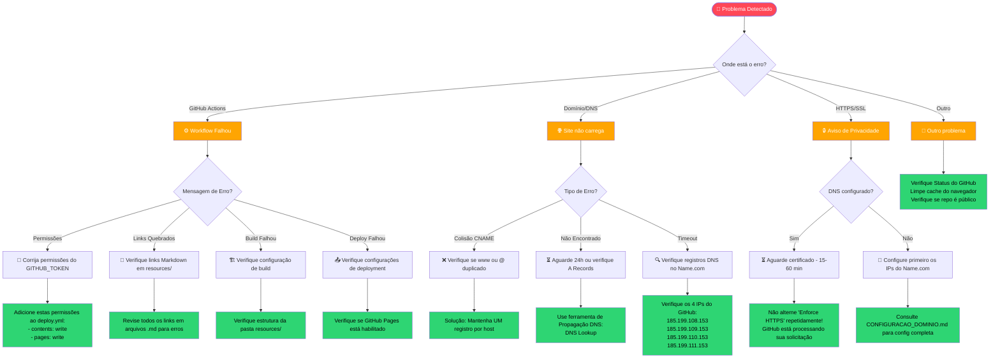
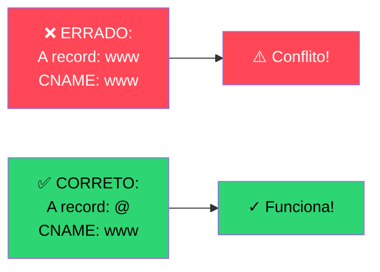
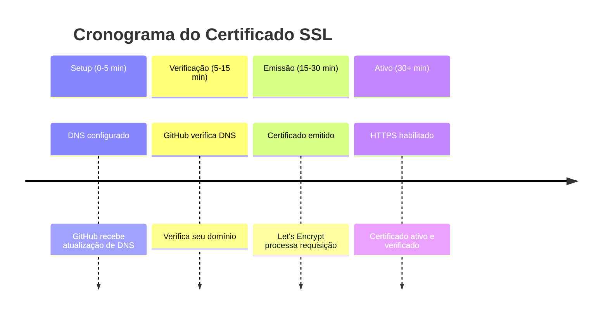
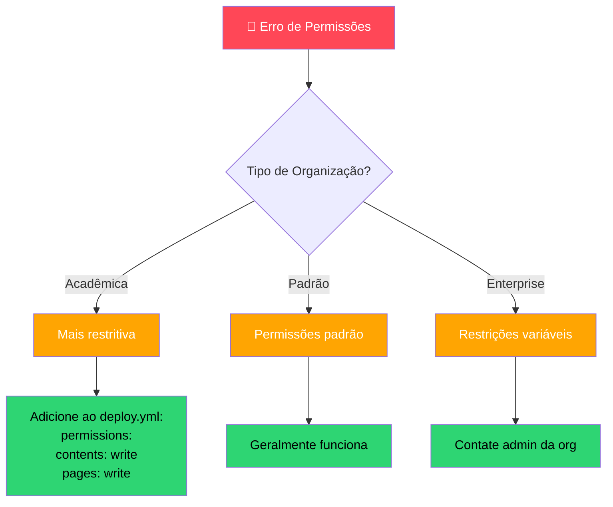
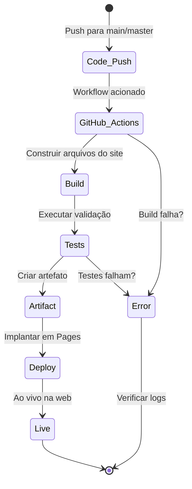
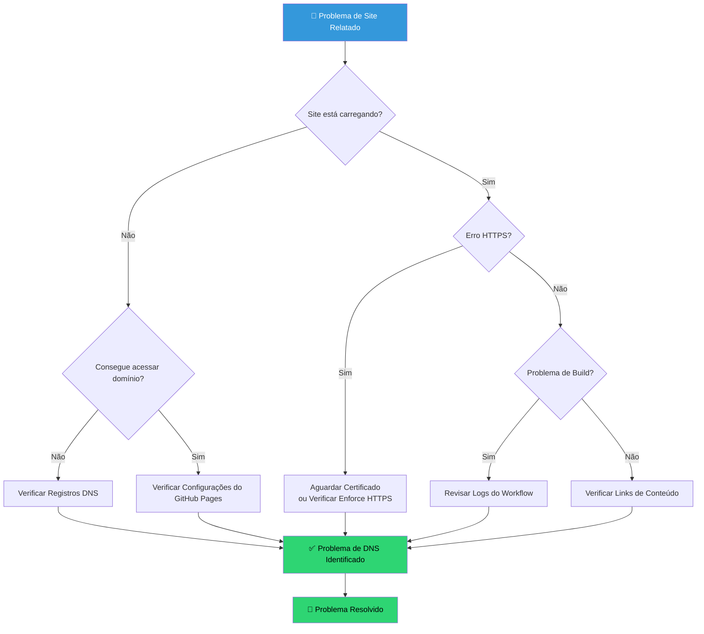

# 🛠️ Resolução de Problemas (Troubleshooting)

Tendo problemas com sua implantação ou domínio? Siga este guia.

## 🌳 Árvore de Decisão Interativa

## 📋 Problemas Comuns & Soluções

### 1. Colisões de Registro CNAME
**Sintoma:** Você não consegue salvar registros DNS no Name.com.
**Solução:** Certifique-se de não ter dois registros para o mesmo host. Por exemplo, se você usar um CNAME para `www`, não deve ter um registro A para `www`.

### 2. Atrasos no Certificado HTTPS
**Sintoma:** Erro "Sua conexão não é privada".
**Solução:** Após apontar o DNS para o GitHub, leva cerca de 15 a 60 minutos para o GitHub verificar e emitir um certificado SSL. **Não** alterne a configuração repetidamente; apenas aguarde.

### 3. Falhas de Permissão de Workflow
**Sintoma:** Logs do GitHub Actions dizem `Permission denied`.
**Solução:** Se você estiver em uma Organização Acadêmica, eles geralmente restringem Actions. Certifique-se de ter `contents: write` e `pages: write` no seu `deploy.yml`.

---

## 🚀 Ciclo de Vida de Implantação do GitHub Pages

## 📊 Fluxo de Trabalho de Resolução de Problemas

## 🔍 Lista de Verificação de Diagnóstico Rápido

**Diagnóstico Rápido**

- [ ] O repo é público?
- [ ] Você esperou 5-10 minutos após fazer push?
- [ ] Todos os registros DNS estão configurados?
- [ ] 'Enforce HTTPS' está desabilitado (até certificado pronto)?
- [ ] Seu CNAME corresponde ao seu domínio?
- [ ] As Actions estão habilitadas no seu repo?
- [ ] Verificar Status do GitHub em status.github.com
