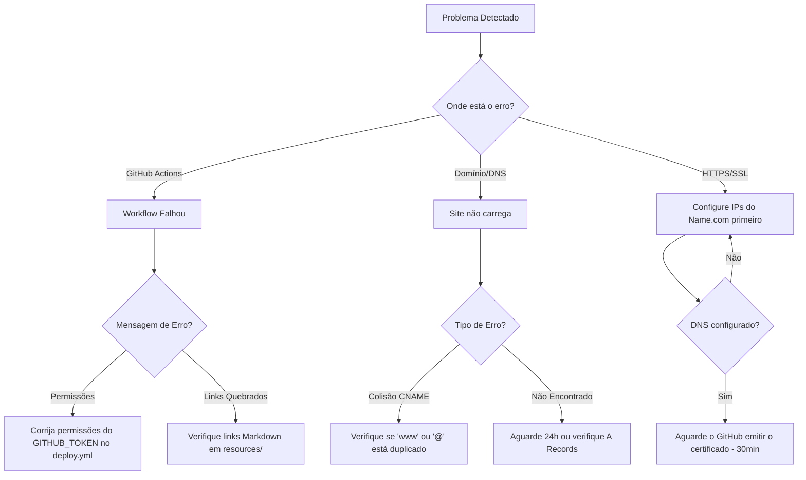
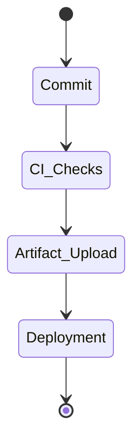

# 🛠️ Resolução de Problemas (Troubleshooting)

## 🌳 Árvore de Decisão

## 📋 Problemas Comuns & Soluções

### 1. Colisões de Registro CNAME
**Sintoma:** Você não consegue salvar registros DNS no Name.com.
**Solução:** Certifique-se de não ter dois registros para o mesmo host. Por exemplo, se você usar um CNAME para `www`, não deve ter um registro A para `www`.

### 2. Atrasos no Certificado HTTPS
**Sintoma:** Erro "Sua conexão não é privada".
**Solução:** Após apontar o DNS para o GitHub, leva cerca de 15 a 60 minutos para o GitHub verificar e emitir um certificado SSL. **Não** alterne a configuração repetidamente; apenas aguarde.

### 3. Falhas de Permissão de Workflow
**Sintoma:** Logs do GitHub Actions dizem `Permission denied`.
**Solução:** Se você estiver em uma Organização Acadêmica, eles geralmente restringem Actions. Certifique-se de ter `contents: write` and `pages: write` no seu `deploy.yml`.

---

## 🚀 Lifecycle do GitHub Pages

