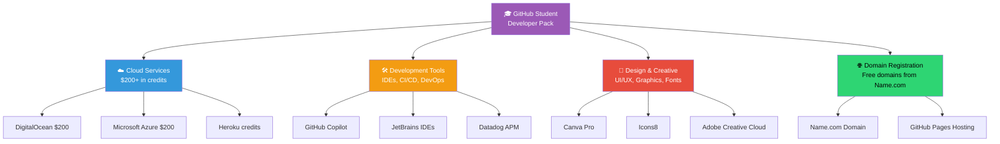
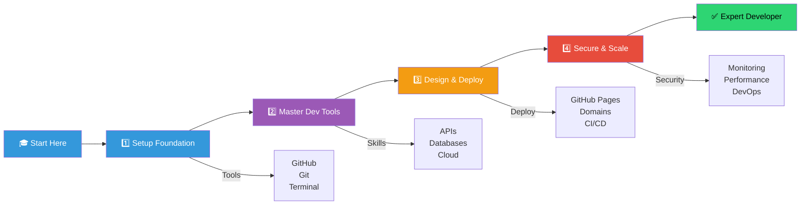
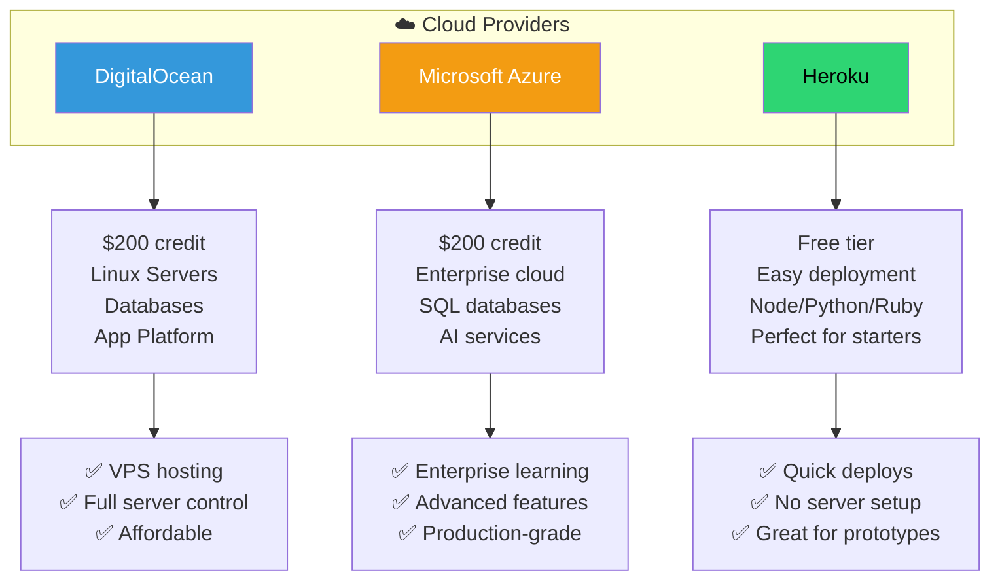
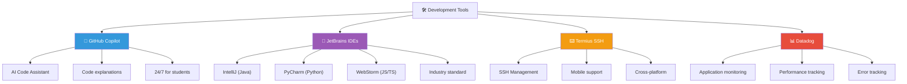
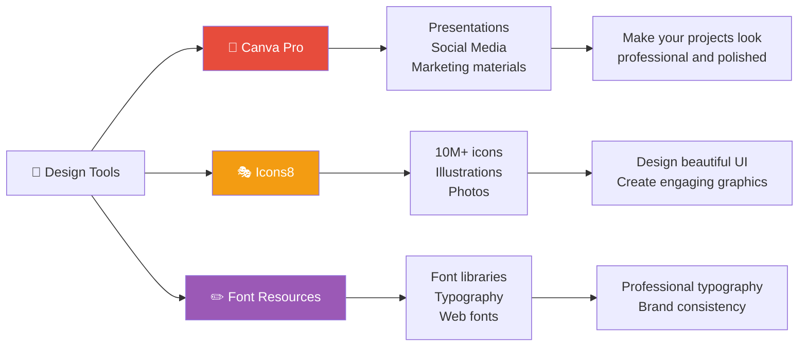
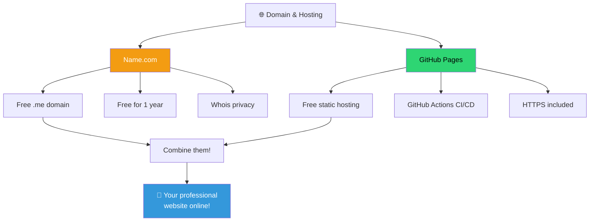
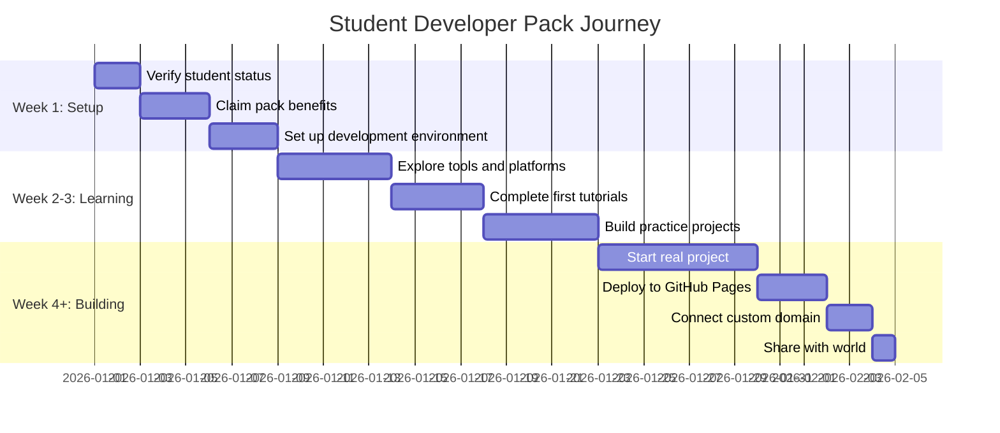
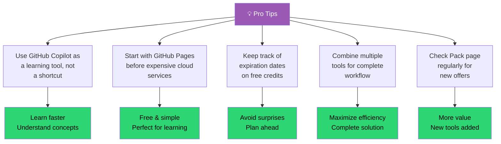

# 📚 GitHub Student Developer Pack Guide

Welcome to your comprehensive guide for maximizing the GitHub Student Developer Pack! This pack includes over $200+ in free credits and services to help you learn and build amazing projects.

## 🎯 What is the GitHub Student Developer Pack?

## 📊 Learning & Growth Path

## ☁️ Cloud & Hosting Services

## 💻 Development Tools & IDEs

## 🎨 Design & Creativity

## 🌐 Domains & Web Hosting

## 📦 Curated Resources by Category

### ☁️ Cloud & Hosting
- **DigitalOcean:** Perfect for simple Linux servers (Droplets). Use your $200 credit wisely!
- **Microsoft Azure:** Great for learning Enterprise-grade cloud. Includes free tier for SQL databases.
- **Heroku:** Easy deployment for Node.js, Python, and Ruby apps.

### 💻 Development Tools
- **GitHub Copilot:** Don't just let it write code; use it to *explain* code you don't understand.
- **JetBrains IDEs:** IntelliJ IDEA (Java), PyCharm (Python), WebStorm (JS/TS). These are the industry standard.
- **Termius:** The best way to manage your SSH connections on both desktop and mobile.

### 🎨 Design & Productivity
- **Canva Pro:** Essential for creating presentations, social media posts, and even your resume.
- **Icons8:** Thousands of icons and illustrations to make your apps look professional.
- **1Password:** Keep your development secrets and personal passwords safe for free for a year.

## ✅ Getting Started Checklist

**Start Using Your Pack Today**

- [ ] Verify your student status with GitHub
- [ ] Visit education.github.com/pack
- [ ] Claim your free domain from Name.com
- [ ] Set up GitHub Copilot
- [ ] Install your preferred JetBrains IDE
- [ ] Create your first GitHub Pages site
- [ ] Explore DigitalOcean or Azure
- [ ] Build something amazing!

## 🚀 Timeline: From Pack to Production

## 💡 Pro Tips for Maximum Value

---

## 🔗 Important Resources

- **Official Pack Page:** [education.github.com/pack](https://education.github.com/pack)
- **Verify Your Status:** Check your GitHub student badge in account settings
- **Contact Support:** Each service has dedicated support for students

---

### 💡 Final Thought
Always check the [Pack page](https://education.github.com/pack) regularly, as new offers are added frequently! Make the most of these resources during your student years—they're incredibly valuable for your development journey.
