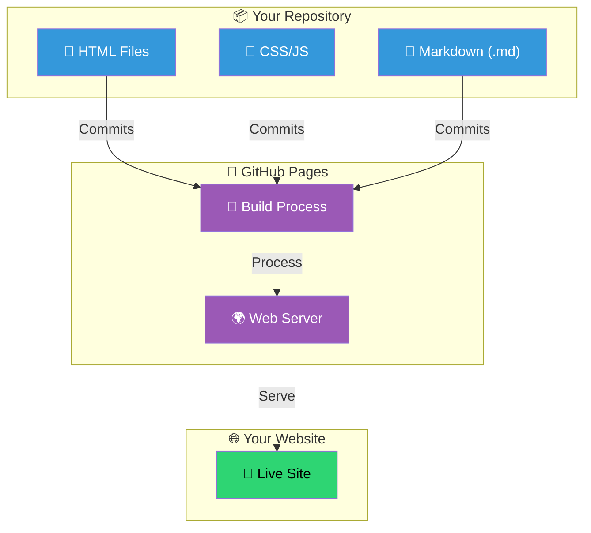
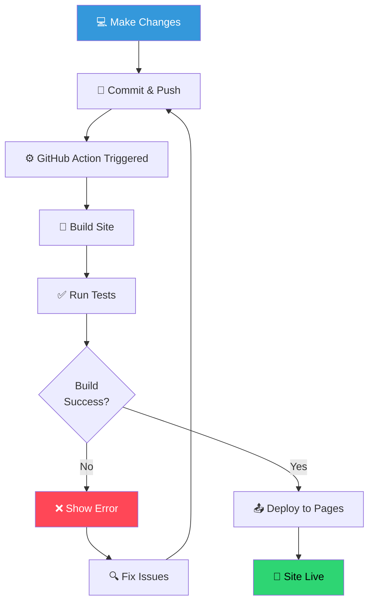
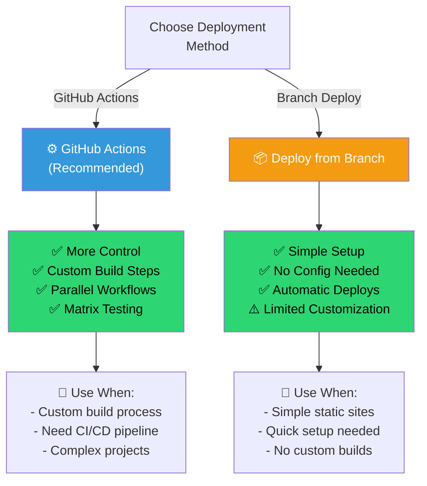
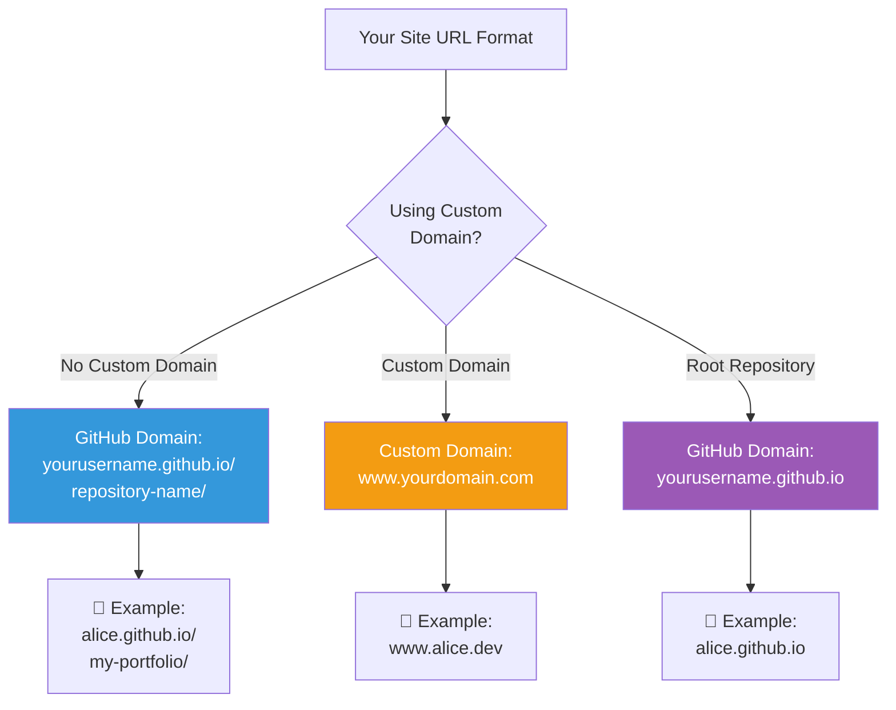
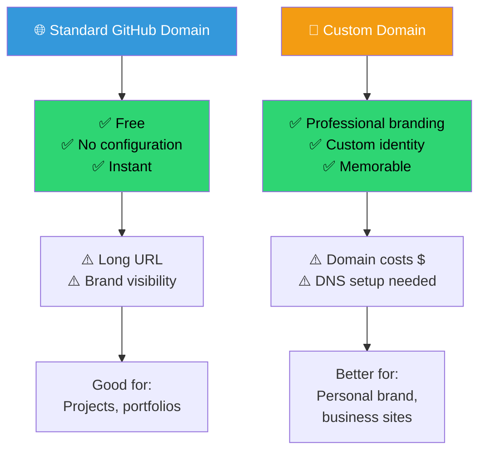
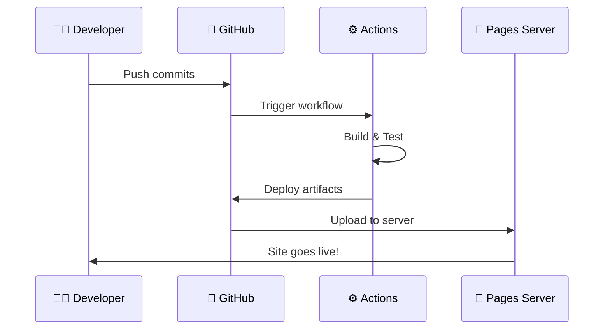

# 📚 Using GitHub Pages for Easy Hosting

## 🎯 What is GitHub Pages?

GitHub Pages is a free static site hosting service that takes HTML, CSS, and JavaScript files directly from a repository on GitHub, and publishes your website.

## 🏗️ Architecture Overview



## 🔄 Deployment Process



## 🎯 How to Enable GitHub Pages


### Step-by-Step Setup:

```mermaid
checklist
    title Enable GitHub Pages in 5 Steps
    - Navigate to your repository Settings
    - Click on 'Pages' in the left sidebar
    - Select 'GitHub Actions' (recommended) or 'Deploy from a branch'
    - If 'Deploy from a branch': Choose your main branch
    - Click Save and wait 1-2 minutes
```

## 🚀 Deployment Options Comparison



## 🌐 URL Formats



## 📊 Efficient Setup Guide

Whenever someone clicks on your repository name, they can access a conventional GitHub Pages site. This allows you to present everything you are creating in a user-friendly manner, making it accessible for anyone to review and familiarize themselves with your work.

### How to Enable:
1. Navigate to your repository **Settings**.
2. Click on **Pages** in the left sidebar.
3. Under **Build and deployment**, select **GitHub Actions** (recommended) or **Deploy from a branch**.
4. Your site will be live at `https://yourusername.github.io/repository-name/`.

## 🎨 Custom Domain Option



It's ultimately up to each user to decide if they want to apply their custom domain (like one from Name.com) to their new site. This flexibility allows for personal branding and enhances the site's professional appearance and accessibility.

## 🔄 Typical GitHub Pages Workflow



## ✅ Verification Checklist

```mermaid
checklist
    title Verify GitHub Pages Setup
    - Repository is public
    - GitHub Pages is enabled in Settings
    - Source branch is correct
    - Build was successful
    - Site URL matches expected format
    - Can access site from browser
    - Content is displaying correctly
    - Links are working properly
```

## 🚀 Next Steps

- **Add Content**: Start building your site with HTML/CSS/Markdown
- **Custom Domain**: Follow the Domain Setup guide to connect your Name.com domain
- **Customize**: Add your own theme, styles, and content
- **Share**: Share your site link with the world!

## 📚 Conclusion

In summary, GitHub Pages offers a simple and effective way to showcase your projects while providing the option for custom domains for those who desire more personalization. Whether you choose to use the standard GitHub domain or a custom one, you'll have a professional, free hosting solution for your web projects.

---

## 🔗 Learn More

- [Official GitHub Pages Documentation](https://docs.github.com/en/pages)
- [Jekyll (Built-in Static Site Generator)](https://jekyllrb.com/)
- [GitHub Student Developer Pack](https://education.github.com/pack)
- [Name.com Domain Registration](https://www.name.com)
