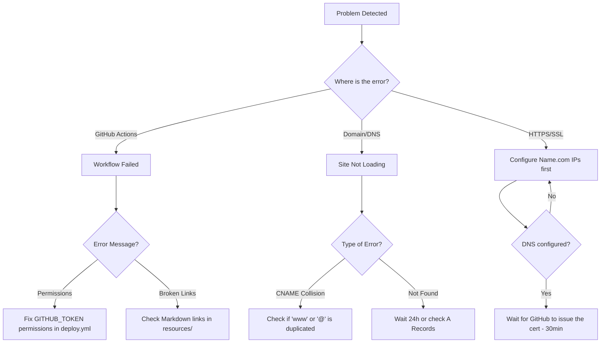
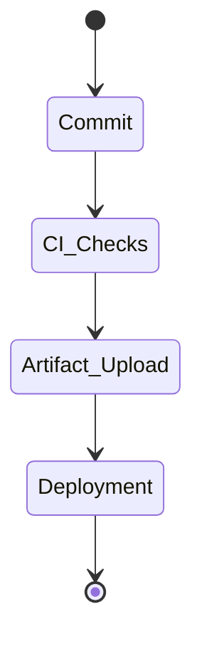

# 🛠️ Troubleshooting & Decision Tree

Having trouble with your deployment or domain? Follow this guide.

## 🌳 Decision Tree

## 📋 Common Issues & Solutions

### 1. CNAME Record Collisions
**Symptom:** You can't save DNS records in Name.com.
**Solution:** Ensure you don't have two records for the same host. For example, if you use a CNAME for `www`, you shouldn't have an A record for `www`.

### 2. HTTPS Certificate Delays
**Symptom:** "Your connection is not private" error.
**Solution:** After pointing DNS to GitHub, it takes about 15-60 minutes for GitHub to verify and issue an SSL certificate. **Do not** toggle the setting repeatedly; just wait.

### 3. Workflow Permission Failures
**Symptom:** GitHub Actions logs say `Permission denied`.
**Solution:** If you are in an Academic Organization (University repo), they often restrict Actions. Ensure you have `contents: write` and `pages: write` in your `deploy.yml`.

---

## 🚀 GitHub Pages Lifecycle

